# VR_KringleCompany
Great Asset, Great Great Asset

## Week 2
Standard Development Flow -> Implement Tech1, Tech2,Tech3,Tech4 -> Test

## Test Driven Development 
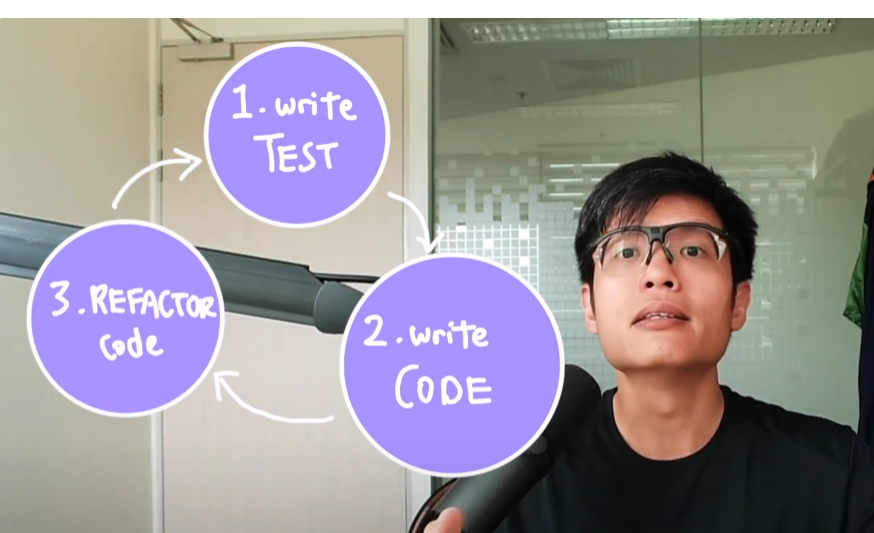

## Immersion

### System Properties Immersion
The specifications of the system that produces immersive experiences
Eg: All the hardware stuff like 1800 x 1920 pixels, seprate LCDs, 106 degrees horizontal, 90 degrees vertical etc...
They all help to facilitate the feeling of immersion.
Theres also software side like the visual fidelity or how realistic the AI and how natural the controls are like finer tracking

### User Experiences Immersion
A mmersion is a mix of psychological and constructs that becomes much more complex yet interesting and rich concept that allows us to measure the desired user experiences this can greatly inform our designs of immersive applications.

## Contributors of Immersion

### Presence
 there has been many interpretations of this concept ever since the original paper by Minsky that coined it in 1980. Nevertheless all the interpretations all converge to a common notion of how much
one feels like being transported to an alternate space the simplest way to put this is that presence describes the feeling of being there from the Abundant research literature that have studied presence we can break down the concept into various dimensions this includes perceptions of the degree of environmental interaction and the perceived Fidelity and realism of simulated environment that is conveyed through our senses another way is to differentiate between the concept of physical presence versus social presence physical presence is the sense of being physically relocated to the virtual space while social presence is the sense of being around other virtual beings in addition it has also been found that individual differences modulates the feeling of presence for example people who Express personality traits like openness and extroversion tends to experience higher presence to measure presence we can either use subjective data objective data or a mix of both in fact this measurement types are typical to most of HCI research as the concept of presence is primarily a subjectively defined notion most have used subjective measures such as self-reporting questionnaires and interviews example of a popularvalidated self-reporting questionnaire is the **Eye Group presence questionnaire** (IPQ).

It is divided into
Spatial Presence - the sernse of being physically present in the VE
Involvement - measuring the attention devoted to the VE and the involvement experienced
Experienced Realism - Measuring the subjective experience of realism in the VE

Chatgpt says this
The "Igroup Presence Questionnaire" (IPQ) is a tool used to measure the sense of presence experienced by individuals in virtual environments. Presence refers to the subjective feeling of being "there" in the virtual environment, as if the virtual experiences were happening in real life.

The IPQ was developed by Schubert, Friedmann, and Regenbrecht in 2001 as a means to quantify and understand the feeling of presence in virtual reality (VR) environments. It consists of a series of questions designed to assess different dimensions of presence, including:

Spatial Presence: The feeling of being physically present within the virtual environment.
Involvement: The extent to which individuals feel engaged and immersed in the virtual experience.
Experienced Realism: The perception of the virtual environment as realistic and believable.
General Presence: The overall sense of presence experienced by individuals.
Participants typically respond to the IPQ by rating statements on a Likert scale, indicating the degree to which they agree or disagree with each statement based on their experience in the virtual environment.

The IPQ is widely used in research to evaluate the effectiveness of VR technologies, understand the factors that influence presence, and assess the impact of presence on user experience and behavior in virtual environments.

If you have specific questions about the IPQ or its application, feel free to ask!

### Flow
sometimes also referred to as being in the zone though can generally be described as a mental state of extreme positive engagement such that a person loses his self-con his or her self-consciousness
it is a feeling of high concentration yet effortless and spontaneous performance of an activity that is associated with a pure feeling of happiness 

Flow has 8 dimension and described by Chatgpt here
Flow, also known as "being in the zone," is a psychological state characterized by complete absorption in an activity, intense focus, and a sense of enjoyment and fulfillment. Flow was first described by psychologist Mihaly Csikszentmihalyi, who identified several dimensions or components of flow experiences.

Csikszentmihalyi initially identified six dimensions of flow, and later expanded this to eight dimensions. These dimensions represent various aspects of the flow experience:

Clear Goals: Having clear and specific goals for the activity, which provide direction and focus.
Concentration: Intense and focused attention on the task at hand, with distractions minimized.
Loss of Self-consciousness: A diminished awareness of oneself and one's surroundings, with attention fully absorbed by the activity.
Distorted Sense of Time: Altered perception of time, with time seeming to pass quickly or slowly depending on the level of engagement in the activity.
Immediate Feedback: Prompt and clear feedback on performance, allowing for adjustments and improvements in real-time.
Balance between Skill and Challenge: Engaging in an activity that matches one's skills and abilities, with the level of challenge balanced to the individual's level of expertise.
Sense of Control: Feeling a sense of control and mastery over the activity, despite the challenges presented.
Intrinsic Reward: Finding intrinsic satisfaction and enjoyment in the activity itself, rather than relying on external rewards or motivations.
These dimensions collectively contribute to the flow experience, which is characterized by a state of optimal performance and subjective well-being. Flow can occur in various activities, including sports, music, art, work, and leisure activities, and is associated with enhanced creativity, productivity, and overall satisfaction.

From Chek
1. Clear Goals
2. Challenge that matches skill
3. Complete Concentration
4. Loss of Self-conscuiusness
5. Sense of Control
6. Effortlessness
7. Transformation of Time
8. Autotelic Experience

Here is an example
Clear Goals: The player has a clear goal in the game, such as completing a difficult level or defeating a boss character.

Concentration: The player is fully immersed in the game, with intense focus on the gameplay mechanics, strategies, and obstacles they encounter.

Loss of Self-consciousness: The player becomes so absorbed in the game that they lose awareness of their surroundings and themselves, fully engaging in the virtual world.

Distorted Sense of Time: Time seems to pass quickly for the player as they play the game, with hours feeling like minutes as they become engrossed in the experience.

Immediate Feedback: The game provides immediate feedback on the player's actions, such as scoring points, completing objectives, or facing consequences for mistakes, allowing them to adjust their strategy and gameplay in real-time.

Balance between Skill and Challenge: The game presents challenges that match the player's skill level, providing an optimal level of difficulty that keeps them engaged without becoming overwhelmed or bored.

Sense of Control: Despite the challenges presented by the game, the player feels a sense of control and mastery over their actions, making strategic decisions and executing precise maneuvers to progress.

Intrinsic Reward: The player finds intrinsic satisfaction and enjoyment in the gameplay itself, experiencing excitement, adrenaline, and a sense of accomplishment when overcoming obstacles and achieving goals within the game world.

You can measure flow through well validated questionnaire instruments like the flow state scale 2.

Here is Chatgpt
The Flow State Scale-2 (FSS-2) is a psychological assessment tool used to measure the degree to which individuals experience the flow state during a specific activity or task. It is an updated version of the original Flow State Scale (FSS) developed by Csikszentmihalyi and Csikszentmihalyi in 1988.

The FSS-2 consists of 36 items that assess nine dimensions of flow, with four items per dimension. These dimensions are:

Challenge-skill balance: The perceived balance between the difficulty of the task and one's skill level.
Action-awareness merging: The feeling of being completely absorbed in the activity, with a merging of action and awareness.
Clear goals: Having clear and specific goals for the activity.
Unambiguous feedback: Receiving clear and immediate feedback on performance.
Concentration on task at hand: Intense and focused concentration on the activity.
Sense of control: Feeling a sense of control and mastery over the activity.
Loss of self-consciousness: Diminished awareness of oneself and one's surroundings.
Transformation of time: Altered perception of time, with time seeming to pass quickly or slowly.
Autotelic experience: Finding intrinsic satisfaction and enjoyment in the activity itself.
Participants rate each item on a Likert scale, indicating the extent to which they agree or disagree with each statement based on their experience during the activity. The scores are then summed to provide an overall measure of flow experienced by the individual.

The FSS-2 is widely used in research to assess flow experiences in various domains, including sports, work, education, and leisure activities. It provides valuable insights into the factors that contribute to flow and its impact on performance, engagement, and well-being.

### Cybersickness
I dont need to tell you what this means yeah. but higher visual vestibular conflict causes more intense symptoms of cyber sickness. Vestibular system is a set of organs found in the inner ear which is a sensory system that tels the body about the position orientation and motion.
We measure validated questionnaries. We use the Simulator Sickness Questionnaire (SSQ). There is also the VRSQ and the CSQ which is recommended for VR activities

### Affordances.
I lazy do

## Mentimeter Questions
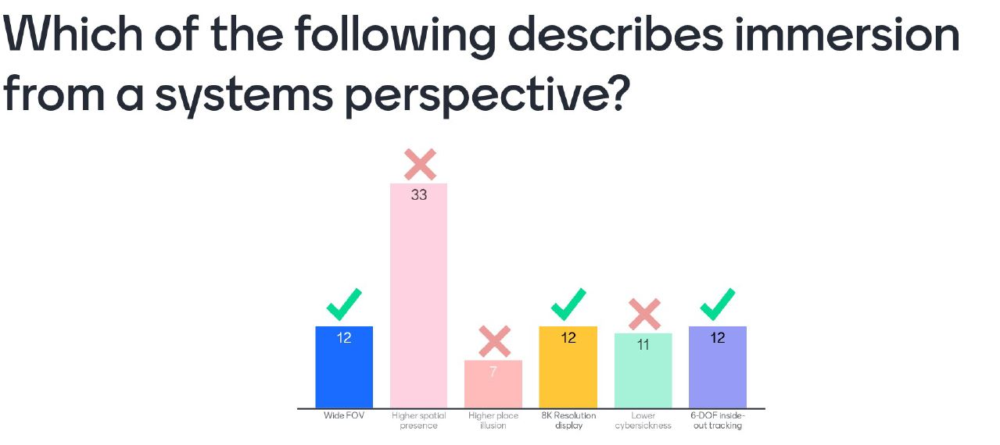
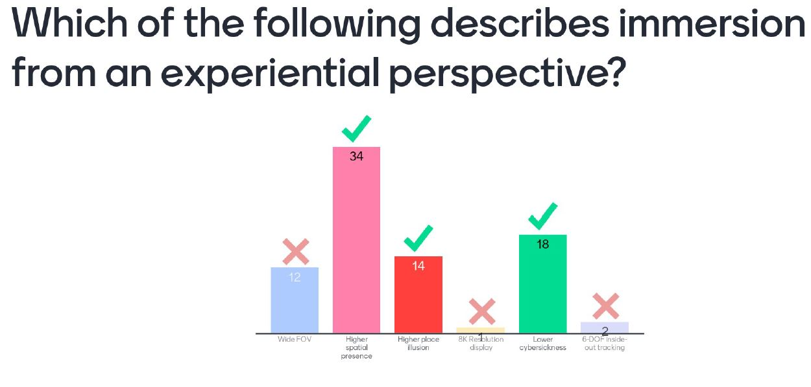
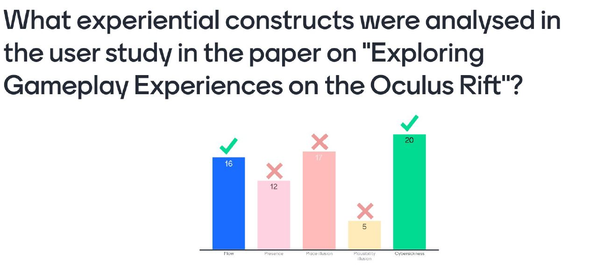
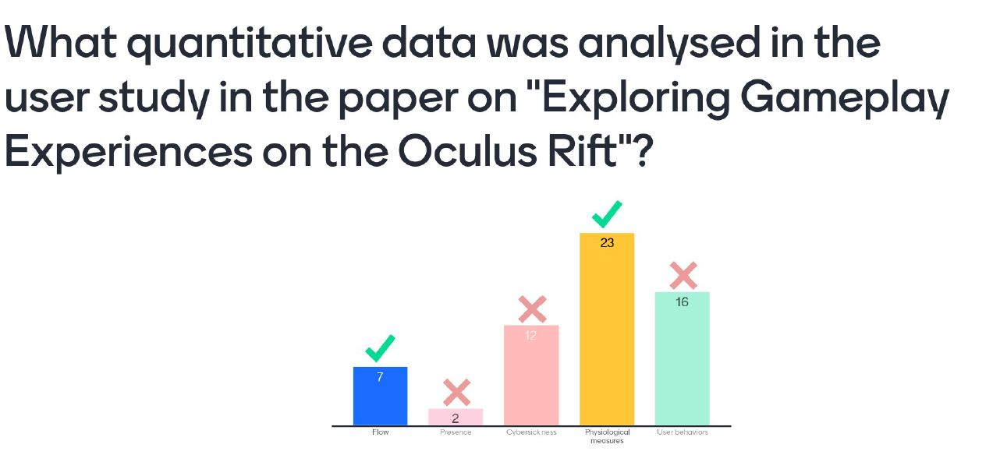
Quantitative data according to chek is something that can be converted to numbers and can be converted into statistics. The reason why flow works is because the flow state thingie is numbers

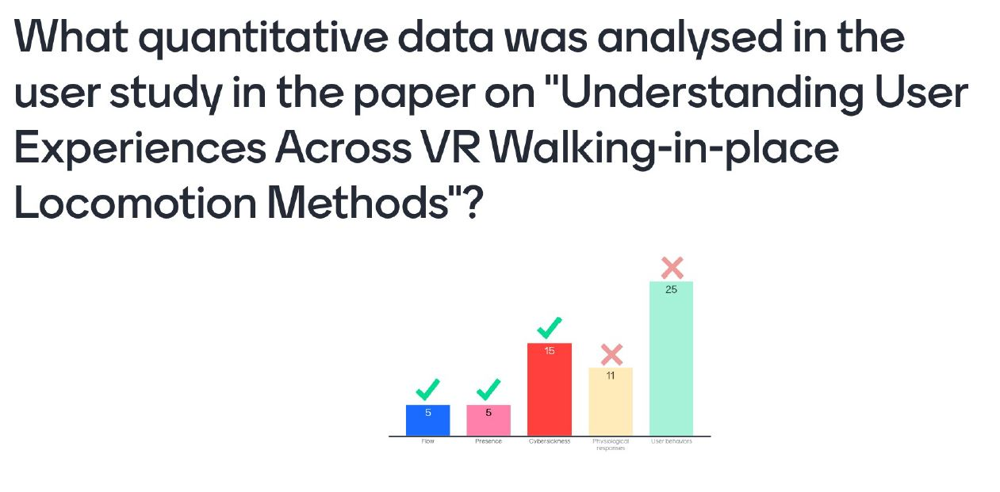
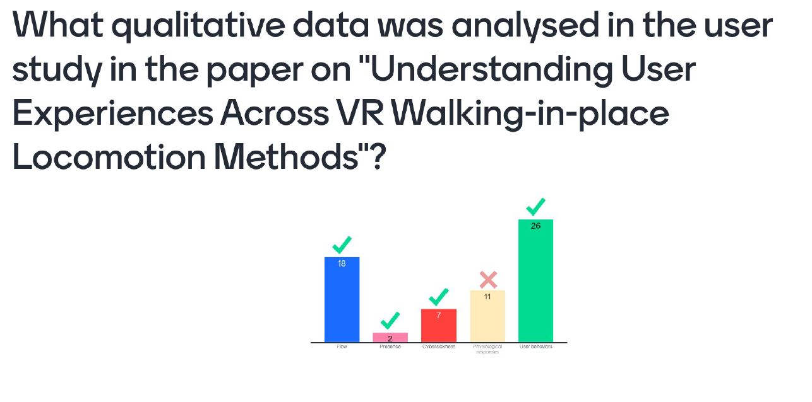
They are also quantitative data also. According to chek, qualitative can "extract more user experiences"

The question for the next slide is the VR version more immersive than the desktop version?
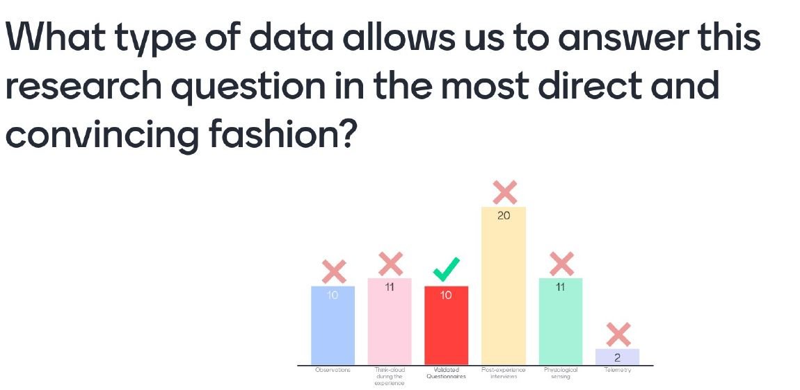

What user experiences does the VR classroom intervention afford during the class
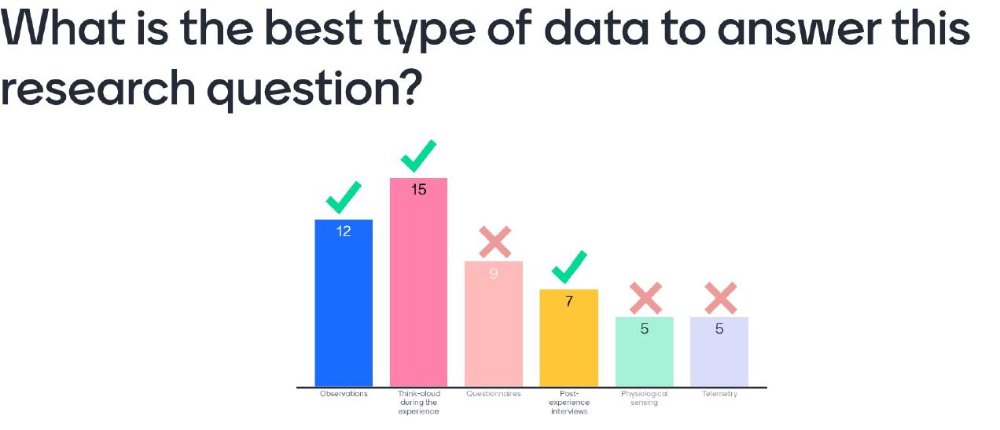
According to him, for this type of questions, when you are trying to discover som phenomenon then go for more qualitative ones which is why you choose these three answers

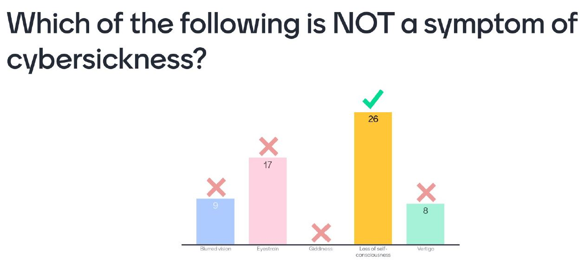
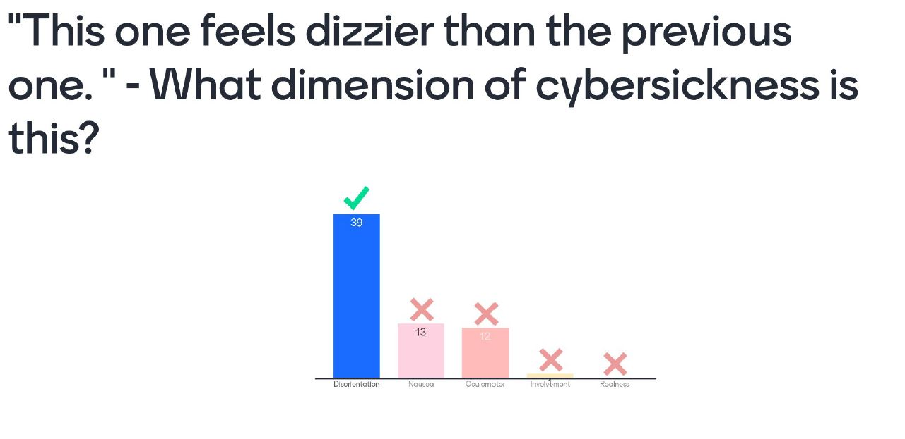
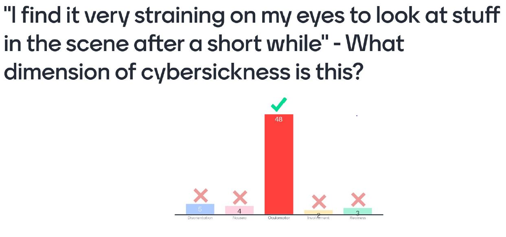
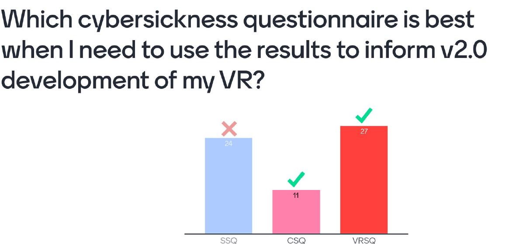
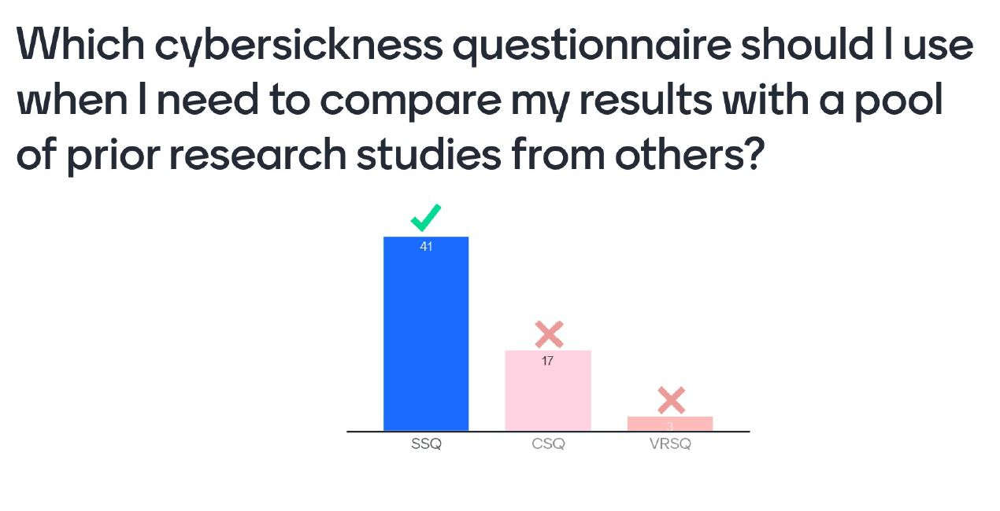

The experience is "I was surpised that 30 minutes already passed when i took off the headset, i thought i was 5 minutes"
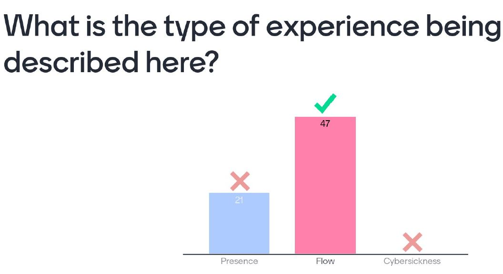

The experience is "My head knocked into the wall as I tried to dodge the ball coming at me. My mom was telling me how close i got to the wall but i was unaware that she mentioned that to me"
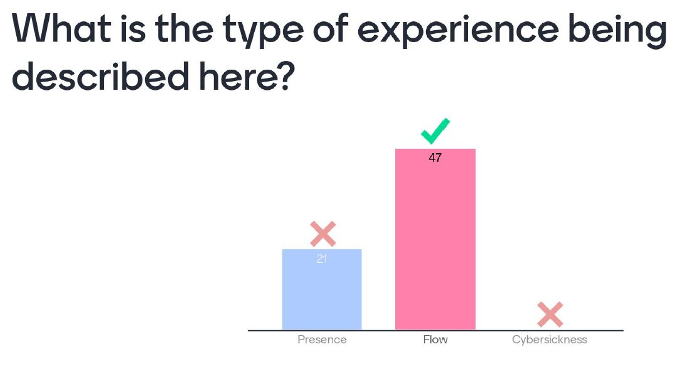

The experience is "My friend was telling me how stupid i looked when I was playing the VR game trying to dodge all the balls but I wasnt aware of how I looked because I was more focused on dodging"
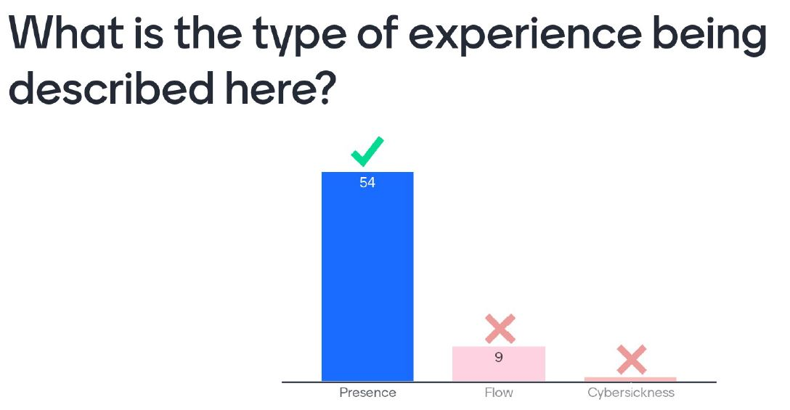

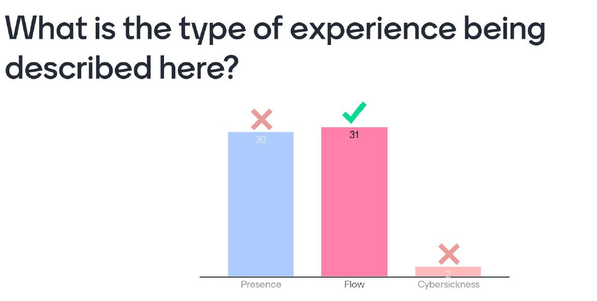
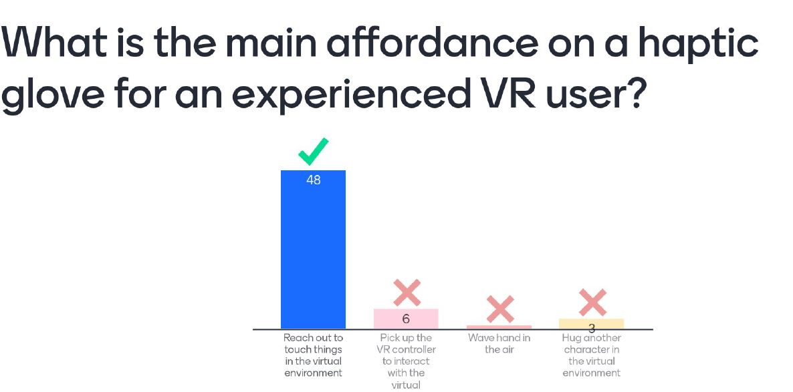
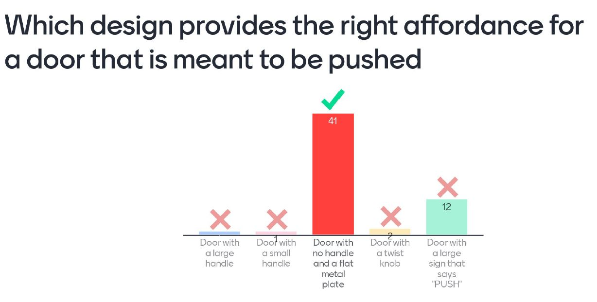
