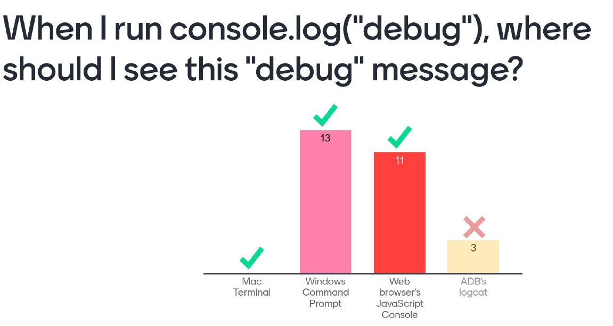
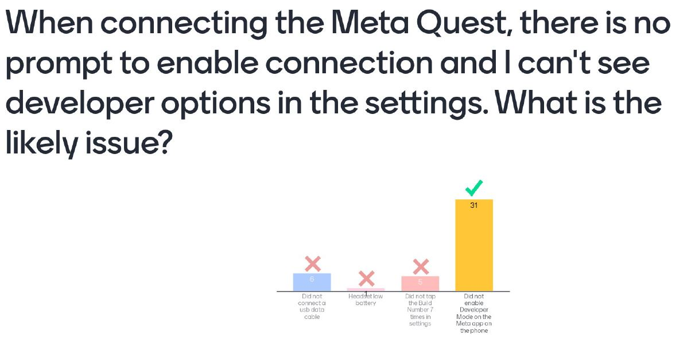
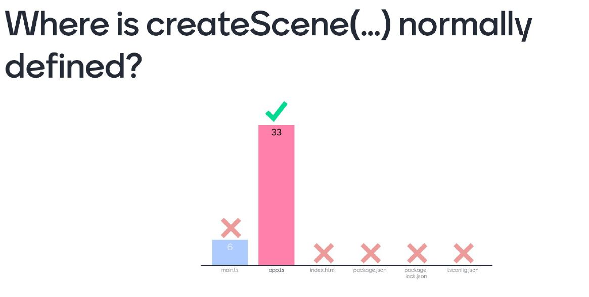
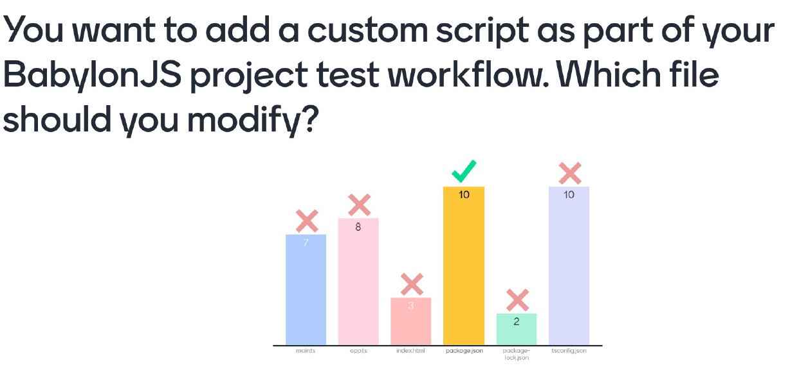
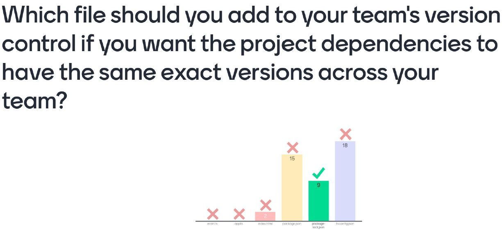
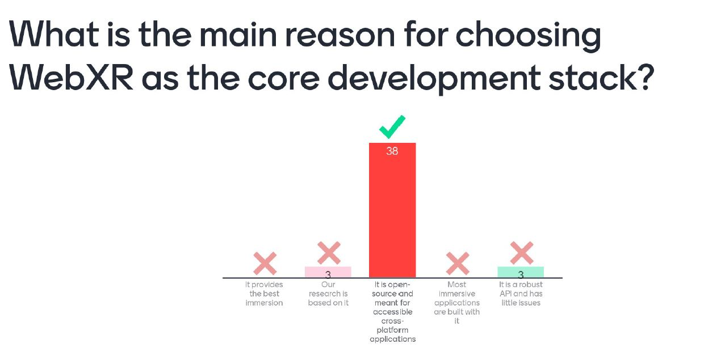
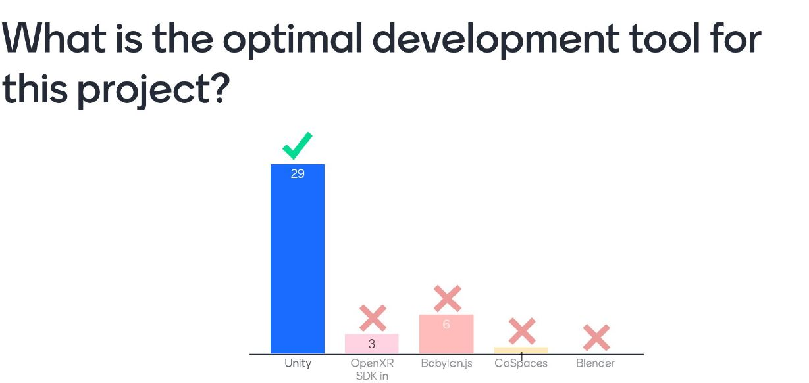
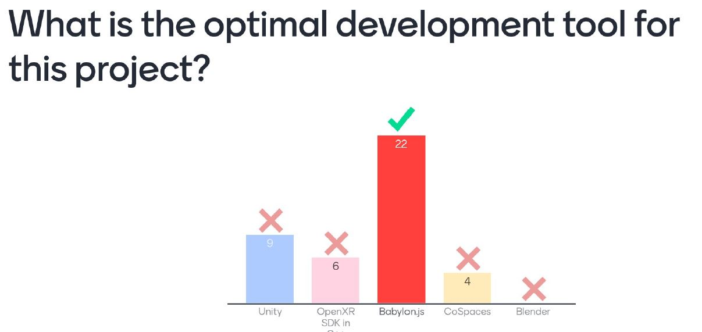
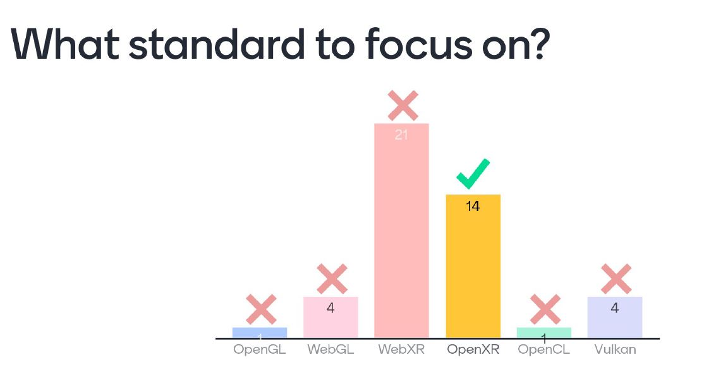

# VR_KringleCompany
Great Asset, Great Great Asset

## Possible Choices for why you choose a paraticular framework
1. Documentation
2. Code Management / Collab
3. Asset creation
4. Dev Tools

### Unity

### Unreal
Chosen For intensive and high quality graphics

### AFrame
According to Chatgpt
A-Frame is an open-source web framework for building virtual reality (VR) experiences. It is primarily used for creating VR scenes, applications, and experiences that run in a web browser. A-Frame is built on top of HTML, making it accessible to web developers who are already familiar with HTML, CSS, and JavaScript. With A-Frame, developers can create 3D, VR-enabled content using a simple HTML-like syntax, making it easier to design, iterate, and deploy VR applications without the need for complex WebGL APIs directly. It is created by Morzilla

A-Frame is based on the Entity-Component-System (ECS) architecture, which is a common pattern in game development. In **A-Frame, everything in the scene is an entity represented by HTML elements, and functionality is added to these entities through components that can modify their appearance, behavior, and functionality. This approach allows for high modularity, reusability, and simplicity in developing VR scenes.**

Developers can extend A-Frame's core functionality by creating custom components using JavaScript, enabling the integration of external libraries and APIs for more complex interactions, animations, and data visualization in 3D and VR. A-Frame supports WebVR and WebXR APIs, allowing it to work across various devices such as VR headsets (e.g., Oculus Rift, HTC Vive), mobile devices with cardboard viewers, and desktop/laptop browsers, providing a wide platform reach.

A-Frame is designed to be accessible for beginners while also powerful enough for advanced developers to build sophisticated VR experiences. It has fostered a growing community that contributes to its development, shares components, and provides resources, making it a popular choice for web-based VR projects.

According to Chek
Pros: designed to be a highly accessible tool for new VR developers with some programming Foundations at the same time it is highly extensible to allow experienced devs to create highly complex VR experiences. Note that applications developed by A-frame can only exist on the web which has the usual obvious pros and cons
1. Extremely Accessible
2. Conducive for learnimg
3. Conducive for Reseasrch
4. Well designed architecture and usable API

Cons: 
the biggest con is perhaps the level of immersion from A System's point of view that is limited by what web Technologies can provide and in many ways limited by the browser developers as well however that is slowly improving as we move from webgl to web GPU which without delving into the rapid hole of advanced rendering topics simply means that we get more and more direct access to Hardware right from your browser relatedly the number of differences between each of the popular browsers is. WebXR resolves that somewhat

Benefits of Web Based Tools
1. Accessible to users and developers

### Babylon JS
From chatgpt
Babylon.js is a powerful, open-source 3D engine that enables developers to create and render 3D graphics within web browsers. It leverages WebGL, WebXR, and other web standards to facilitate the development of interactive 3D applications, games, and immersive experiences directly on the web, without the need for plugins or additional software installations.

The core strengths of Babylon.js include its comprehensive feature set, ease of use, and strong performance. It is designed to be accessible to beginners, with a straightforward API and extensive documentation, while also offering the depth and flexibility required for complex projects by advanced users.

Key features of Babylon.js include:

Rich 3D Graphics Rendering: Supports advanced graphics features like shadows, lighting, textures, particle systems, and more, enabling the creation of realistic and visually appealing scenes.
Physics Engine Integration: Integrates with popular physics engines, allowing for realistic simulations of physical interactions within the 3D world.
Support for WebXR: Enables the creation of virtual reality (VR) and augmented reality (AR) experiences that are compatible with a wide range of devices, from smartphones to dedicated VR headsets.
Animation System: Comes with a sophisticated animation system that supports complex animations, blending, and transitions for 3D objects.
GUI Support: Provides a library for creating interactive 2D user interfaces within 3D scenes, facilitating the development of comprehensive user experiences.
Extensibility: Developers can extend Babylon.js with custom shaders, materials, and more, thanks to its modular architecture.
Community and Ecosystem: Benefits from a vibrant community and ecosystem, offering numerous examples, extensions, and plugins to help accelerate development.
Babylon.js is widely used for a variety of web-based 3D projects, including games, interactive visualizations, training simulations, and architectural walkthroughs. Its commitment to being cross-platform ensures that Babylon.js applications can run on any device with a web browser, making it a versatile choice for developers looking to leverage 3D graphics on the web.

From Chek
1. Scaled down Unity interfacd
2. Rendering and physics using state of the art techniques and "target performance"
3. Large and active community

## Mentimeter Questions

